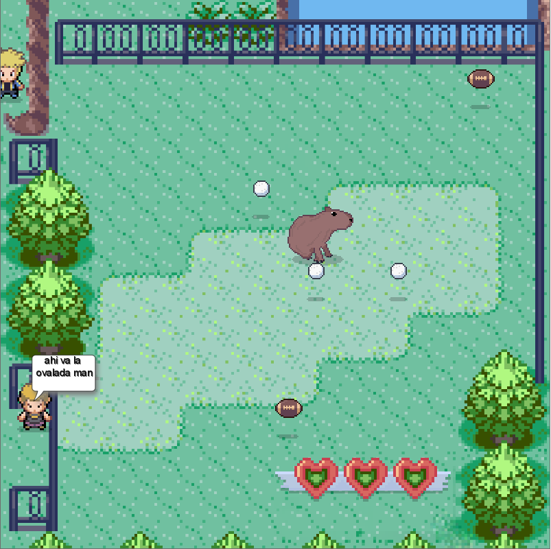
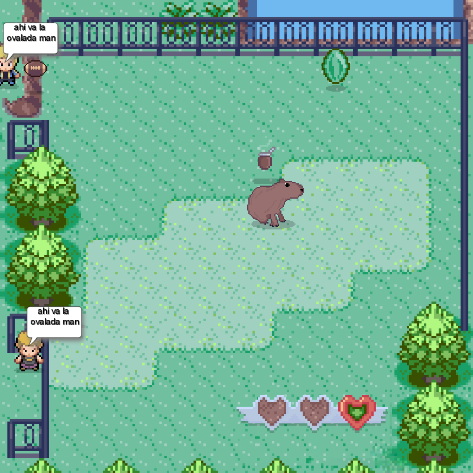

# Carpinchos Invasores

## Equipo de desarrollo

- Lecaldare Augusto
- Alexander Kalinin
- Leandro Marcelo Lienard Guerrisi
- Felipe Nani
- Santiago Arrascaeta
- Gonzalo Gabriel Garmon

## Capturas

## Reglas de Juego / Instrucciones

El juego tiene como protagonista un Carpincho, el cual se encuentra por circunstancias de la vida en Nordelta, donde sus habitantes no felices con su presencia lo verán como una amenaza, atacandolo así con objetos que encuentren a su alcance.
 Nuestro objetivo será sobrevivir la mayor cantidad de tiempo posible, recolectando durante ese tiempo la mayor cantidad de mates.
 Inicialmente poseemos tres corazones, los cuales indicaran nuestra vida, pueden ir variando según lo que vaya sucediendo en la partida;
  - En el caso de recibir un proyectil por parte de los habitantes de Nordelta nuestra vida disminuirá (2 corazones con una pelota de Rugby, 1 con una pelota de Golf)
  - En el caso de comer frutas que se encuentren en el escenario nuestra vida aumentará (1 corazon por fruta)

## Respuestas teóricas

https://docs.google.com/document/d/1wi-YANzntYX6elPttjOHRiR3DDf08p5CEjq-tA9EnjE/edit?usp=sharing
